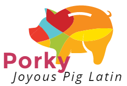

Porky - Joyous Pig Latin Generator
==================================

Porky is a [Pig Latin](https://en.wikipedia.org/wiki/Pig_Latin) generator made
to demonstrate a full Continuous Integration (CI) pipeline. 

It's done as part of the course [WASP Software Engineering](http://wasp-sweden.org/custom/uploads/2017/02/Assignment-2-Tool-Chain.pdf)

Build Status
------------

- Todo

Running
-------

- Todo

Developing
----------

- Build

About
-----
Demonstration project part of the course [WASP Software Engineering](http://wasp-sweden.org/custom/uploads/2017/02/Assignment-2-Tool-Chain.pdf)

Done by
- X , Y , Z